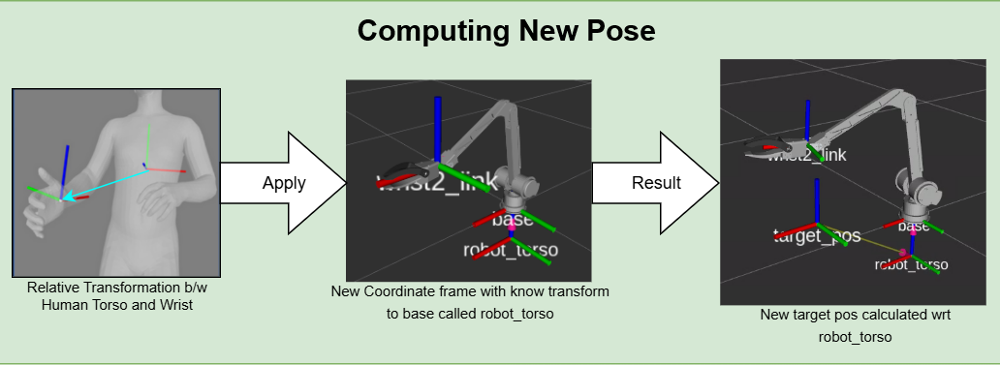
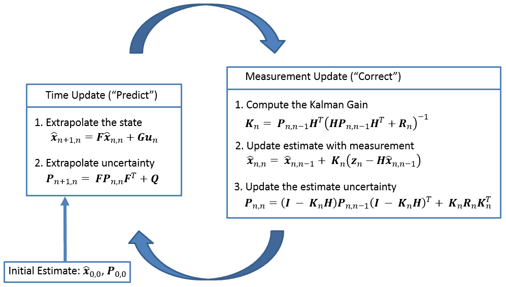
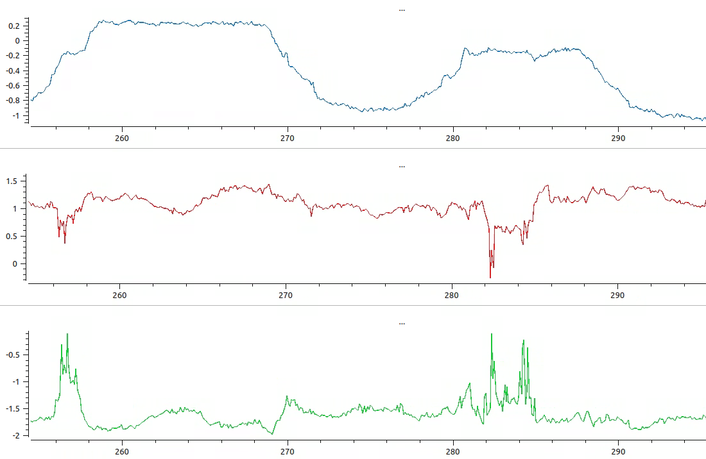
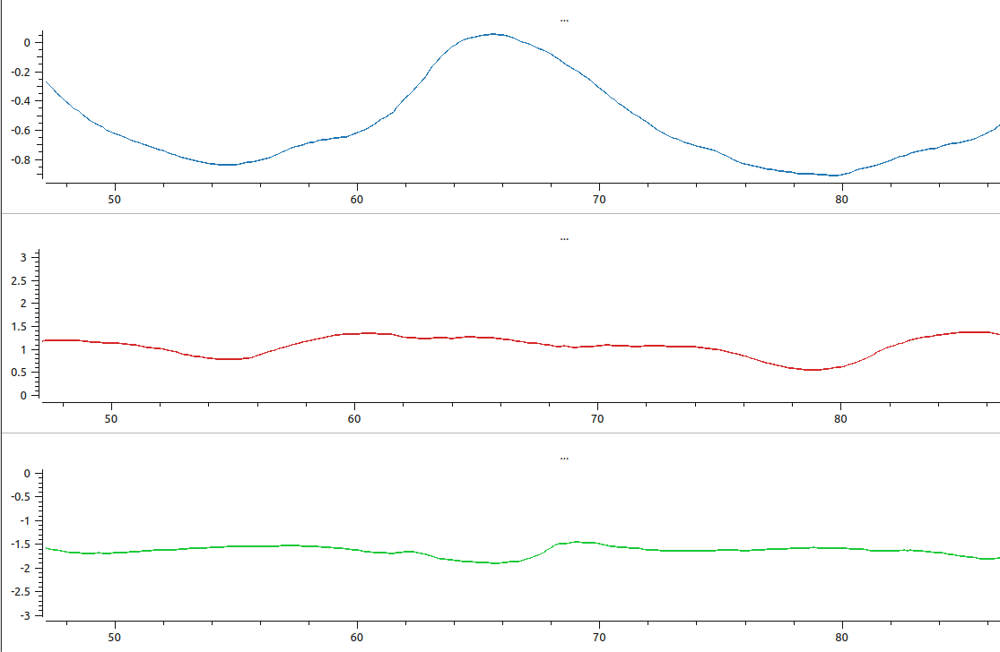
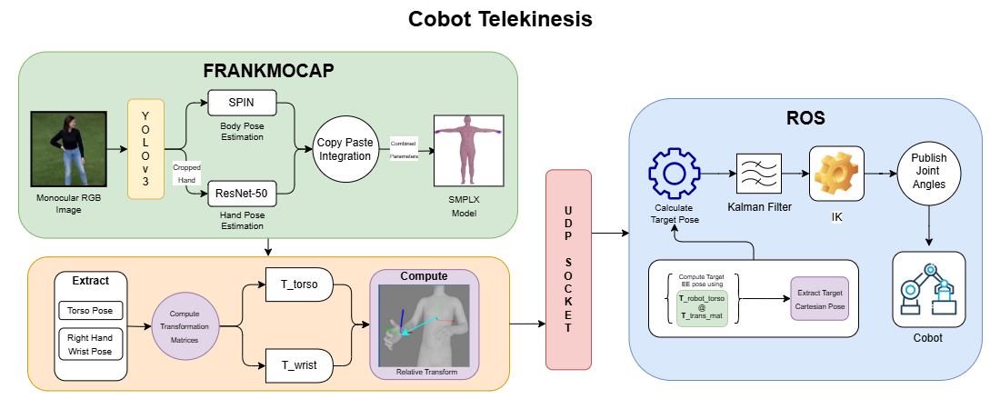

# Cobot-C1 Telekinesis

This Repo is a modified version of Frankmocap to perform Monocular camera based Robot Telekinesis with Cobot-C1 robotic arm

For getting more information about Frankmocap and installation instructions:

See [FRANKMOCAP.md](docs/FRANKMOCAP.md)

**NOTE:** This submodule is designed to be used in conjunction with MRL Cobo Sim ROS package

## Key Challenges

1. **No depth data or camera intrinsics**: Hard to determine how far the human wrist is from the camera.
2. **No camera-to-robot calibration**: Cannot directly map image-space positions to robot-space.
3. **Different body structures**: Human and robot body geometries vary greatly.

---

## Core Insight

Instead of mapping **absolute wrist positions**, the system maps **relative transformations**:

> The **relative transformation between the human wrist and their torso** is transferred to the **robot wrist relative to the robot torso**.

This assumption holds well in practice and simplifies cross-domain retargeting.

---

## Method Overview

### 1. **Full Body Pose Estimation using Frankmocap**
- Given a RGB image, Body and Hands are first detected using a **YOLOv3** detector
- Crop of the human body and hands are separately passed to a **SPIN** regressor and **Resnet-50** based regressor respectively to estimate SMPL-X parameters:
  - `β_b ∈ ℝ¹⁰`: Body shape
  - `θ_b ∈ ℝ⁴⁵`: Joint rotations (24 joints)
  - `φ_b ∈ ℝ³`: Global orientation
- Parameter outputs for both body and hands are combined using a **copy paste integration** method
- Output: Full 3D body mesh, including wrist position and orientation.
> `Copy Paste Integration Method:` **copies** the relevant hand pose parameters and **pastes** them into the correct position of the SMPL-X body pose vector.

### 2. **Coordinate Frame Definition**

| Entity          | Frame Origin            | Axes Definition                          |
|----------------|-------------------------|------------------------------------------|
| Human torso    | Human’s pelvic area      | x → front, y → left, z → up              |
| Robot torso    | 15cm below base frame*   | x → front, y → left, z → up              |
| Wrist (both)   | Wrist joint             | x → out of palm, y → toward thumb, z → toward middle fingertip |

##### \* Can be adjusted further
---

### 3. **Relative Transformation Computation**
- 3D joint positions are extracted directly from **SMPLX** model outputs (appropriately scaled by some factor)
- Torso orientation is simply extracted from the **SMPLX** model outputs as a Rotation Matrix
- For getting the wrist orientation
  - We convert the **global hand pose** estimated from Resnet-50 to **local**
  - We then traverse **human kinematic chain** from torso to wrist (using SMPL-X) chaining rotations as we move forward to integrate the new **local hand pose** into the kinematic chain.
  - Above step ensures that we get a robust **hand pose** estimation which is aligned with the parent body
- After obtaining Torso and Right hand wrist poses, they are converted into **4x4 Homogenous Transformation Matrices** for easier computation.
- Relative Transformation Matrix is found using:
```
  T_relative = Inv(T_torso) @ T_wrist
```
- The translation part of resulting matrix is scaled using a scaling factor
- **Scaling Factor**
```
  scale_factor = 0.45/||l_shoulder_pos - r_shoulder_pos|| # 45cm Average shoulder width (Men)
```

> This sidesteps the need for global alignment and allows a "floating camera" approach.

---
### 4. Gripper State Estimation
- Calculated using the distance between the thumb and the tip of the index finger.

- A sliding window filter is applied to ensure robustness against transient outliers.

---
### 5. Command Transmission
- **Transformation Matrix** and **Gripper State** is packed and sent to a ROS Node using a **UDP Socket** for further processing and execution.
- A local socket is used to make it easier to communicate between Frankmocap running in **conda** environment and **ROS** environment.
- This ensures low-latency communication for real-time robot control.
---

### 6. Target Pose Calculation
- **Relative Transformation** is applied to the Robot torso frame to get the target robot wrist pose as 
```
  T_target = T_robot_torso @ relative_transformation_matrix
```

- `x,y,z,phi,psi` are then extracted from resulting **T_result**
---
### 7. **Post-processing**
To ensure stability and smoothness:
- **Low-pass filtering** using a **Kalman filter** is done: 



---

### 8. **Inverse Kinematics**
- Final smoothed wrist target pose is converted into **joint angles** using analytical inverse kinematcs equations for Cobot-C1

---

### 9. **Motion Execution**
- Telekinesis motion is executed by pulishing **JointState** msg on a rostopic using a tuned **PD controller**

## Results

This method enables smooth, real-time teleoperation of the robot arm using only a monocular camera and passive 3D body estimation, while ensuring:
- Realistic and responsive motion
- Generalization across users and environments
- No sudden movements

### Joint Angles Smoothing
- Below we can see the 3 joints values with and without Kalman filter smoothing
#### Without Kalman Filter



#### With Kalman Filter



### Test on Recorded Video


## Performance

The setup was tested on a **Nvidia Tesla T4** 16GB VRAM and **Nvidia RTX 4080 super** 24GB VRAM 

| Setup          |     Parameters        |        FPS           |
|----------------|-------------------------|------------------------------------------|
| Nvidia Tesla T4   | Live video without optimization     | 2.5 FPS |
|                   | Live video with optimization        | 4 FPS   |
|                   | Pre-computed Bounding Box       | 10 FPS  |
| Nvidia RTX 4080s  | Live video without optimization      | 8 FPS   |
|                   | Live video with optimization         | 12 FPS  |
|                   | Pre-computed Bounding Box        | 16 FPS  |

\* Optimization includes using *multiple precision*, *GPU synchronization* and *vectorized computation*
## How to Run

### **Prerequisites:**
- To run Cobot Telekinesis system, make sure to clone and build the Cobo-C1 ROS workspace as well as setup frankmocap-mrl and install appropriate dependencies.
- In one terminal navigate to *frankmocap-mrl* folder and activate frankmocap conda environment using-
```
  conda activate <env_name>
```

- In another terminal navigate to *Cobot-C1* folder, make sure to source it using
```
  source ./devel/setup.bash (or zsh depending on terminal)
```

### Using Pre-computed Bounding Boxes:
- If you are using pre-computed bbox use the following command to start the frankmocap script
```
  python -m demo.demo_frankmocap --input_path <path to saved bbox folder> --out_dir ./mocap_output --renderer opengl_gui --cobot
```

- If you haven't computed bounding boxes, you can use this command to pre-compute and save them
```
  python -m demo.demo_frankmocap --input_path <path to video> --out_dir ./mocap_output --save_bbox_output --save_frame
```
- Bounding boxes and corresponding frames will be saved under *mocap_output* folder

### Using Live video or Webcam:
- If you want to use a video or webcam and compute bounding boxes on the go, use the following command
- **Using saved video**
```
  python -m demo.demo_frankmocap --input_path <path to video> --out_dir ./mocap_output --renderer opengl_gui --cobot
```
- **Using webcam** (Need to be tested)
```
  python -m demo.demo_frankmocap --input_path webcam --renderer opengl_gui --cobot
```

### Run ROS Node
- After running the *demo_frankmocap* script, it will start the UDP server and wait for cobot client
- In the other ROS workspace sourced terminal, run the ROS node using the following command
```
  python3 ./src/cobo_control/src/cobot_telekinesis.py
```
- **NOTE:** Running this ROS Node without running frankmocap script first will result in an error

## CLI Arguments
- `--cobot` tag enables connection to cobot ROS node for sending transformation matrix and gripper state corresponding to different frames
- `--visualize` tag can be used for toggling 3D mesh visualization in glViewer (will affect Performance)
- More information about CLI arguments can be found [Here](https://github.com/GigabyteZX1/frankmocap_mrl/blob/36fdaf474b09a3b67500827ea8c57803cac188b6/demo/demo_options.py#L11)

## Modifications to Frankmocap
Since our application required fast close to realtime telekinesis operation, some changes had to be made to Frankmocap pipeline
* As we only require pose information about some specific joints only, all other extra computations have been removed
* Using copy-paste type hand and body pose integration method for getting higher FPS as EFT base based integration optimization is computationly expensive and requires precomputed OpenPose Keypoints to work.
* Added mixed precision and gpu synchronization for *hand bbox detection*, can be found [Here](https://github.com/GigabyteZX1/frankmocap_mrl/blob/opt/handmocap/hand_bbox_detector.py#L114)
* Added vectorized calculations for *body bbox detection*
* Removed OpenCV visualization, using glViewer visualization with toggleable mesh 
* **telekinesis_utils.py** script is added to facilitate connection with cobot, different conversions and transformation matrix formation.
* Added extra CLI argument to facilitate ease of use and debugging in [demo_options.py](https://github.com/GigabyteZX1/frankmocap_mrl/blob/opt/demo/demo_options.py)

## Cobot Telekinesis ROS Node

### Components Overview

#### 1. **KalmanFilter**

A simple 5D Kalman Filter for smoothing noisy pose estimates (x, y, z, φ, ψ).

- `apply(measurement)`: Performs the prediction and update steps of the Kalman filter.
- Helps to stabilize target end-effector poses before IK and control.

#### 2. **CobotTelekinesis**

Main node that handles:

- UDP connection to receive transformation data (e.g., from a headset or external tracker).
- Kalman filtering to smooth pose commands.
- Conversion of pose to joint space via inverse kinematics.
- Sending smoothed joint commands to the robot via ROS.

##### Key Functions

- `__init__()`:
  - Initializes ROS publishers and subscribers.
  - Sets default parameters like velocity limits, home pose, etc.
  - Sets up Kalman filter and data buffers.

- `connect_socket()`:
  - Establishes a UDP connection to the external transformation data sender.
  - Sends a handshake and waits for connection confirmation.

- `joint_state_callback(msg)`:
  - Updates internal state of robot joint positions using ROS topic `/cobo/joint_state_act`.

- `move_to_home()`:
  - Generates a trajectory from current end effector position to home position or the very first point using cubic or linear interpolation.
  - Uses `CubicTrajectoryPlanner` or `LinearTrajectoryPlanner`.

- `execute_trajectory(trajectory)`:
  - Publishes trajectory points (joint positions & velocities) at a defined rate to ROS.

- `read_loop()`:
  - Continuously listens to the UDP socket.
  - Handles messages like "CLOSE_CONNECTION".
  - Buffers and processes JSON messages representing transforms.

- `process_message(message)`:
  - Decodes 4x4 homogeneous transform matrix from UDP stream.
  - Extracts Gripper State information
  - Computes New target pose for the end-effector using **T_robot_torso @ transform matrix**
  - Extracts the new end-effector pose and applies Kalman filtering.
  - Computes IK solution for the resulting pose.
  - Publishes joint commands to `/cobo/joint_command`.

- `extract_target_pose(T_target_robot)`:
  - Extracts `[x, y, z, φ, ψ]` from a 4x4 matrix.
  - φ (pitch) and ψ (yaw) are extracted from rotation matrix.
  - Currently sets ψ to zero as a temporary fix.

- `run()`:
  - Starts the UDP socket listener in a separate thread.
  - Spins ROS node.

---

### Logic Flow

```text
[UDP Transform Data] --> [Extract and Compute Target Pose] --> [Kalman Filter] --> [Pose Extraction] --> [Inverse Kinematics] --> [Joint Angles] --> [Publish JointState]
```

### ROS Topics

- Publishes:
  - `/cobo/joint_command` → `JointState` messages to control robot.
- Subscribes:
  - `/cobo/joint_state_act` → `JointState` messages for feedback.

---

### Message Format

Incoming messages via UDP should be JSON-encoded 4×4 transformation matrices:

```json
[[1, 0, 0, 0.1],
 [0, 1, 0, 0.2],
 [0, 0, 1, 0.3],
 [0, 0, 0, 1]]
```

- The `T[3,3]` field is used to encode the **gripper state** (1=open, 0=closed).
- This is then reverted to 1 after parsing for pose calculation.

Outgoing message is a ROS message of type JointState having structure as follows:
- `mode`
- `position`
- `velocity`
- `effort`
## Current Pipeline


## Future Improvements
- Further Improve performance for Real Time operation using multiple GPUs for parallel computations
- Change ResNet backbone with updated models for improved detection and decreased inference time
- Shift to **ROS2** to make use of native DDS
## References
The main idea behind this project is taken from this paper
```
@misc{sivakumar2022robotictelekinesislearningrobotic,
      title={Robotic Telekinesis: Learning a Robotic Hand Imitator by Watching Humans on Youtube}, 
      author={Aravind Sivakumar and Kenneth Shaw and Deepak Pathak},
      year={2022},
      eprint={2202.10448},
      archivePrefix={arXiv},
      primaryClass={cs.RO},
      url={https://arxiv.org/abs/2202.10448}, 
}
```
Monocular Pose Estimation is taken from works on Frankmocap paper
```
@misc{rong2020frankmocapfastmonocular3d,
      title={FrankMocap: Fast Monocular 3D Hand and Body Motion Capture by Regression and Integration}, 
      author={Yu Rong and Takaaki Shiratori and Hanbyul Joo},
      year={2020},
      eprint={2008.08324},
      archivePrefix={arXiv},
      primaryClass={cs.CV},
      url={https://arxiv.org/abs/2008.08324}, 
}
```